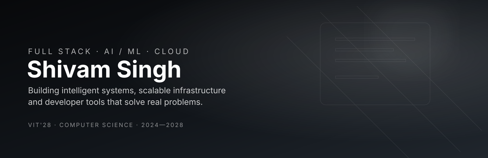

<div align="center">



</div>

<br>

<div align="center">

`@th-shivam`

# Shivam Singh

**engineer · ai/ ml · full stack · open source**

building intelligent systems, scalable backends,  
and products that solve real problems.

[linkedin](https://www.linkedin.com/in/shivam-singh-352492310) ·
[github](https://github.com/th-shivam) ·
[portfolio](https://th-shivam.github.io/Modern_portfolio/) ·
[email](mailto:anotnet.shivam@gmail.com)

</div>

<br>

---

## about

i'm a computer science undergraduate at **VIT Bhopal**.

i enjoy working at the intersection of **software engineering and artificial
intelligence** — building everything from multi-agent systems and voice
assistants to serverless cloud infrastructure.

i care about writing software that is not only functional, but **modular,
scalable and maintainable**.

currently exploring:

`agentic ai` · `llms` · `backend systems` · `cloud architecture` · `security`

---

## things i've built

### `reacher`

**agentic ai · full stack · automation**

an AI-powered cold outreach engine designed to automate the repetitive parts
of job applications and recruiter outreach.

a multi-agent pipeline handles:

`job description → candidate profile → writer → reviewer`

built with **Google ADK + Gemini**, FastAPI, React 19, TypeScript,
MongoDB/Appwrite, Clerk and Gmail APIs.

**→ 80% reduction in manual outreach effort**

[repository ↗](https://github.com/th-shivam/reacher)

---

### `issuepilot`

**serverless · aws · open source**

a cloud-native platform for discovering beginner-friendly GitHub issues.

built around an event-driven architecture:

`eventbridge → lambda → github api → dynamodb → api`

includes GitHub OAuth, API throttling, scheduled data synchronization and
automated deployment through Vercel.

**→ 100 req/s throughput · 200 request burst**

[repository ↗](https://github.com/th-shivam/issuepilot)

---

### `vyom`

**ai assistant · voice · automation**

a modular personal AI assistant built in Python.

combines speech-to-text, NLP intent extraction, action routing, tool
execution, text-to-speech, real-time search and automation.

designed around `asyncio` and `multithreading` to keep continuous voice
interaction responsive.

[repository ↗](https://github.com/th-shivam/vyom)

---

## work

**Cyber Warriors Club — VIT Bhopal**  
`core member · ethical hacking team`

worked on a game-simulation platform supporting **400+ concurrent
participants**, focusing on reliable real-time behaviour under concurrent
workloads.

also designed security challenges involving spectrogram analysis and
classical cryptographic ciphers.

<br>

**GirlScript Summer of Code**  
`project admin · open source contributor`

promoted to project admin and led development and maintenance of **VYOM**.

worked with a distributed contributor base and reviewed contributions from
**30+ developers**, focusing on modularity, maintainability and consistency.

---

## stack

<div align="center">

### languages


<br><br>

### build


<br><br>

### ai

`llms` · `ai agents` · `nlp` · `prompt engineering`  
`gemini` · `groq` · `cohere` · `speech-to-text` · `text-to-speech`

<br><br>

### cloud


<br><br>

`lambda` · `api gateway` · `dynamodb` · `eventbridge` · `fastapi`

<br><br>

### tools


</div>

---

## beyond code

**250+** DSA problems solved  
**50+** Codeforces problems  
**400+** concurrent users handled  
**30+** open-source contributors coordinated

<br>

**winner — Innovit'26 Hackathon**

built **MedProof**, a blockchain-based medicine verification system.

<br>

**Kaggle × Google**

5-Day AI Agents Intensive Course

---

## currently

```text
building       →  agentic ai + full-stack systems

learning       →  distributed systems + cloud security

exploring      →  llm applications + intelligent automation

looking for    →  interesting problems worth solving
