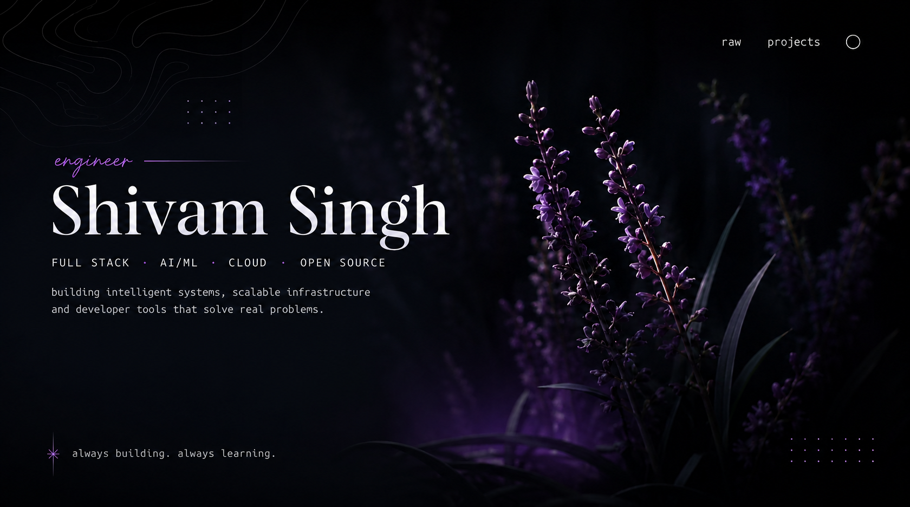

<div align="center">


</div>

<br>

<div align="center">

`@th-shivam`

[linkedin](https://www.linkedin.com/in/ryzenshivam) ·
[github](https://github.com/th-shivam) ·
[portfolio](https://www.thakurshivamsingh.me) ·
[email](mailto:anotnet.shivam@gmail.com)

</div>

<br>

---

## about

i'm a computer science undergraduate at **Vellore Institute of Technology**.

i enjoy working at the intersection of **software engineering and artificial
intelligence** — building everything from multi-agent systems and voice
assistants to serverless cloud infrastructure.

i care about writing software that is not only functional, but **modular,
scalable and maintainable**.

currently exploring:

`agentic ai` · `llms` · `backend systems` · `cloud architecture` · `security`

---

## things i've built

<br>

### `reacher` — agentic cold outreach engine

`agentic ai` `full stack` `automation`

An AI-powered outreach engine that automates the repetitive parts of job
applications and recruiter outreach.

**pipeline**
`job description → candidate profile → writer → reviewer`

**built with**


`Google ADK` · `Gemini API` · `Clerk` · `Gmail API` · `Appwrite`

**→ 80% reduction in manual outreach effort**

[repository ↗](https://github.com/th-shivam/reacher)

<br>

---

<br>

### `issuepilot` — serverless issue discovery platform

`serverless` `aws` `open source`

A cloud-native platform for discovering beginner-friendly GitHub issues.

**pipeline**
`eventbridge → lambda → github api → dynamodb → api`

**built with**


`Lambda` · `API Gateway` · `DynamoDB` · `EventBridge` · `Supabase Auth`

**→ 100 req/s throughput · 200 request burst capacity**

[repository ↗](https://github.com/th-shivam/issuepilot)

<br>

---

<br>

### `vyom` — modular AI assistant

`ai assistant` `voice` `automation`

A modular personal AI assistant built in Python, combining speech-to-text,
NLP intent extraction, action routing, tool execution, text-to-speech,
real-time search and automation.

**pipeline**
`speech-to-text → intent extraction → action routing → response generation`

**built with**


`Groq` · `Cohere` · `asyncio` · `multithreading`

**→ maintained by 30+ open-source contributors**

[repository ↗](https://github.com/th-shivam/vyom)

<br>

---

## work

**Cyber Warriors Club — VIT Bhopal**  
`core member · ethical hacking team`

worked on a game-simulation platform supporting **400+ concurrent
participants**, focusing on reliable real-time behaviour under concurrent
workloads.

also designed security challenges involving spectrogram analysis and
classical cryptographic ciphers.

<br>

**GirlScript Summer of Code**  
`project admin · open source contributor`

promoted to project admin and led development and maintenance of **VYOM**.

worked with a distributed contributor base and reviewed contributions from
**30+ developers**, focusing on modularity, maintainability and consistency.

---

## stack

<div align="center">

### languages


<br><br>

### frontend & backend


<br><br>

### cloud & data


`lambda` · `api gateway` · `dynamodb` · `eventbridge`

<br><br>

### ai / ml

`llms` · `ai agents` · `nlp` · `prompt engineering`  
`gemini` · `groq` · `cohere` · `speech-to-text` · `text-to-speech`

<br><br>

### tools


</div>

---

## beyond code

**250+** DSA problems solved  
**50+** Codeforces problems  
**400+** concurrent users handled  
**30+** open-source contributors coordinated

<br>

**winner — Innovit'26 Hackathon**

built **MedProof**, a blockchain-based medicine verification system.

<br>

**Kaggle × Google**

5-Day AI Agents Intensive Course

---

## currently

```text
building       →  agentic ai + full-stack systems

learning       →  distributed systems + cloud security

exploring      →  llm applications + intelligent automation

looking for    →  interesting problems worth solving
```
